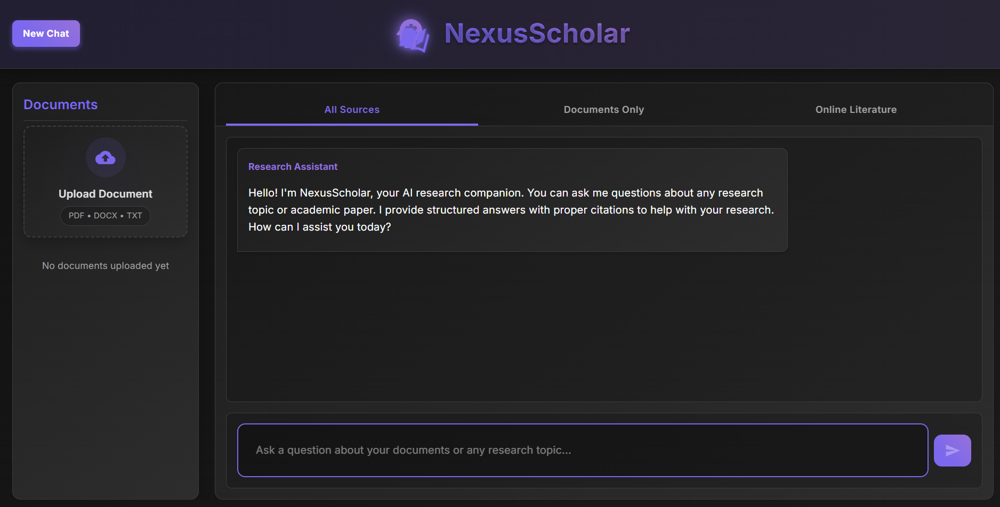

# 🤖 NexusScholar – AI Research Assistant

NexusScholar is a powerful AI-powered research assistant that bridges the gap between academic knowledge and user queries. Built using Retrieval-Augmented Generation (RAG), it answers complex research questions with structured, cited responses.



---

## ✨ Features

- 📄 Document Upload: PDF, DOCX, TXT support  
- 🔍 Academic Search: Queries arXiv and PubMed  
- 💬 Smart Q&A: Ask questions about uploads or external papers  
- 🔗 Dual Mode: Use both uploaded documents and online sources  
- 🧠 LLM Integration: Uses Groq with LLaMA 3 70B  
- 📚 Context Retention: Ongoing session memory  
- 🌙 Dark UI: Sleek modern interface  

---

## 🗂️ Project Structure

```

research-agent/
├── backend/
│   ├── api/
│   ├── document\_processing/
│   ├── search/
│   ├── requirements.txt
│   └── run.py
└── frontend/
├── public/
├── src/
│   ├── components/
│   └── App.js
└── package.json

````

---

## 🚀 Getting Started

### 🔧 Backend Setup

``` bash
# Create virtual environment
python -m venv venv

# Activate it
# Windows:
venv\Scripts\activate

# macOS/Linux:
source venv/bin/activate

# Install backend dependencies
cd backend
pip install -r requirements.txt
````

Create a `.env` file in the `backend/` directory with the following content:

```
GROQ_API_KEY=your_groq_api_key_here
```

Run the backend server:

```bash
python run.py
```

---

### 🎨 Frontend Setup

```bash
# Go to frontend directory
cd frontend

# Install dependencies
npm install

# Start the development server
npm start
```

---

## 🌐 Usage

1. Open your browser and navigate to: `http://localhost:3000`
2. Upload PDF, DOCX, or TXT files using the file uploader
3. Ask questions about uploaded documents or search academic databases
4. View structured answers with proper citations

---

## 🛠️ Tech Stack

**Backend:**

* FastAPI
* FAISS (Vector Search)
* Groq API (LLaMA 3 70B)
* SentenceTransformers
* PyMuPDF / pdfplumber
* python-docx

**Frontend:**

* React
* Material-UI
* react-dropzone
* axios

---

## 🔒 Privacy

* Uploaded documents are processed in-session
* No long-term data storage
* Everything runs on your local machine unless otherwise configured

---
## 📌 Future Plans
* Export citations (BibTeX, EndNote)
* Add annotation & highlighting tools
* Extend support for more file formats
* Implement persistent chat memory

---

## 🤝 Contributing

Pull requests are welcome!
For major changes, please open an issue first to discuss what you'd like to change.

---

## 📄 License

This project is licensed under the MIT License – see the `LICENSE` file for details.


